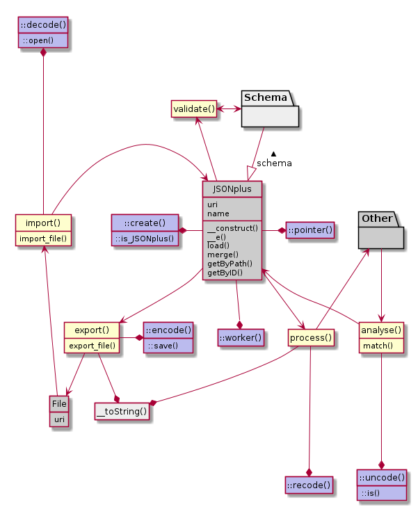

# JSONplus

This library is meant to be upgrade against the standard PHP function `json_encode()` and `json_decode()`.

By its design `\JSONplus::encode()` and `\JSONplus::decode()` is similar. It ensures the extensions &mdash; the *plus* in *JSONplus* &mdash; to integrate:
- PrettyPrinting, and print-fixes like `\/` and e.g. replacing your `"true"` to the boolean `true`.
- ignoring comments, but allowing them to be in your *json*-file
- datalists, for the ease of reusing data
- negative keys in your array
- error handling

We added more static functions:
- `\JSONplus::open()` is the filehandeling alternative to `\JSONplus::decode()`
- `\JSONplus::save()` is the filehandeling alternative to `\JSONplus::encode()`
- `\JSONplus::create()` gives an JSONplus object
- `\JSONplus::pointer()` lets you substract data by path
- `\JSONplus::is()` is a pattern-matcher. It reads its input, and results in a boolean, depending on the rules. It plays well on the levels of data-integrity `\JSONplus::decode()` and `\JSONplus::uncode()` require. It can also test the integrity of an JSONplus object. It combines the `->match()` and `->validate()` depending the rules provided.
- `\JSONplus::uncode()` is a selective reader. Compared to `::decode()` it looses data. Used in parsers based upon JSONplus.
- `\JSONplus::recode()` is a selective writer. Compared to `::encode()` it looses data. Used in parsers based upon JSONplus.
- `\JSONplus::worker()` helps gathering the variables passed-through by a bash script like `php -f script.php` and `cat my.json | php -f script.php`.

But its real strength comes by `new JSONplus()`. This object encapsules the data and enables additional functionality:
- `->import()` and `->import_file()`
- `->export()` and `->export_file()`
- `->load()` replaces the dataset, while `->merge()` combines with the existing dataset.
- `->getByPath()` and `->getByID()` helps you navigate the dataset.
- `->match()` is the non-static alternative of `\JSONplus::is()`
- `->validate()` checks the dataset against its schema. NOTE: requires the [JSONplus-schema](https://github.com/JSONplus/schema) extension.
- `->analyse()` is a selective reader.
- `->process()` is a selective writer.

Additional to JSONplus we will provide [extensions](https://github.com/JSONplus/) to handle other data-structures then *json*. We provide the data-mapping. You access the data.

