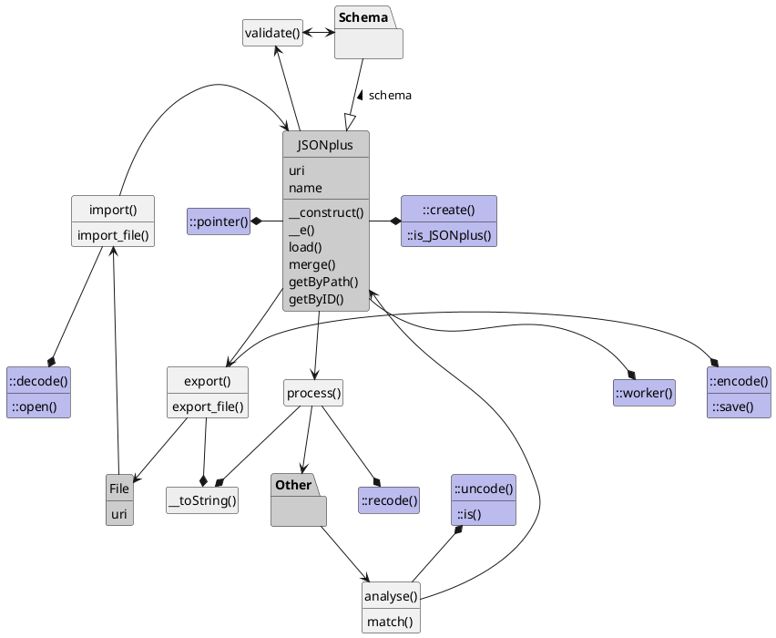

```plantuml
@startuml
class File #CCCCCC {
	uri
}
class JSONplus #CCCCCC {
	uri
    name
	__construct()
    __e()
    load()
    merge()
    getByPath()
    getByID()
}

class "__toString()" #EEEEEE

together {
	JSONplus --> "export()"
	"export()" --> File
    class "::encode()" #BBBBEE {
    	::save()
    }
	"export()" -left-* "::encode()"
	"export()" --* "__toString()"
}

together {
	File -left-> "import()"
	"import()" -right-> JSONplus
    class "::decode()" #BBBBEE {
    	::open()
    }
	"import()" -down-* "::decode()"
}

class "export()" {
    export_file()
}
class "import()" {
    import_file()
}

together {
	JSONplus --> "process()"
    "process()" --> Other
    "process()" --* "__toString()"
    class "::recode()" #BBBBEE
    "process()" --* "::recode()"
    Other --> "analyse()"
    "analyse()" -up-> JSONplus
    class "::uncode()" #BBBBEE {
    	::is()
    }
    "analyse()" -up-* "::uncode()"
}

package Other #CCCCCC {

}
package Schema #EEEEEE {

}

JSONplus -up-> "validate()"
"validate()" <-right-> Schema
Schema --|> JSONplus : "< schema"

class "analyse()" {
	match()
}


class "::pointer()" #BBBBEE
JSONplus -left-* "::pointer()"

class "::create()" #BBBBEE {
	::is_JSONplus()
}
JSONplus -right-* "::create()"

class "::worker()" #BBBBEE
JSONplus --* "::worker()"


hide empty members
hide circle
@enduml
```
